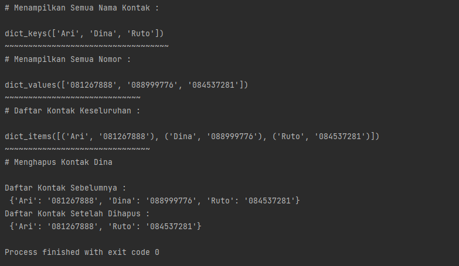
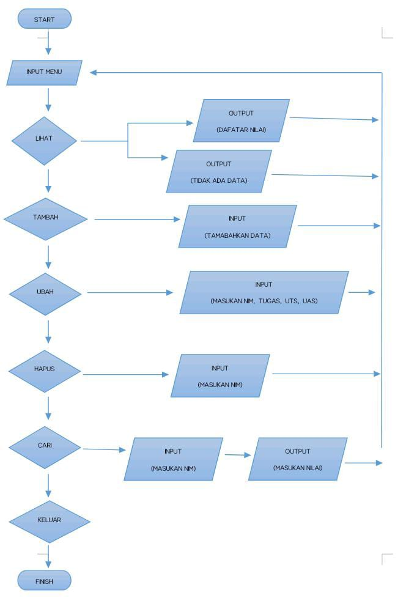

#Lab5py
## Inayatus sholekhawati
## 312210200
## TI.22.A.2

### PRATIKUM 5
### LATIHAN DICTIONARY
```
Dictionary berfungsi untuk menyimpan kumpulan data
```
Nilai dengan pendekatan "Key-Volue"

Dictionary sendiri memiliki dua buah komponen inti:

    1. Yang pertama adalah KEY, ia merupakan nama atribut suatu item pada Dictionary.
    2. Yang kedua adalah VALUE, ia adalah nilai yang disimpan pada suatu atribut.

## SOURCE COODE


## Penjelasan
1. Membuat Dictionary daftar kontak.``` r={'Ari':'081267888','Dina':'087677776'}```.
2. Menampilkan kontak, menggunakan ```r['Ari]```. r adalah variabel dictionary, sedangkan ['Ari] adalah keys dari sebuah dictionary.
pyhoton: ```print("Menampilkan kontak Ari:",r['Ari]).```
3. Menambahkan kontak baru dengan ```Variabel_dictonary.['keys']=varibel;```
pyhoton:```r['riko']='087654544';```
4. Mengubah kontak yang lama menjadi baru menggunakan ```Variabel_dictonary['keys]=volume;```
contohnya mengnakan kontak dina yang awalnya ```'Dina':'08677776'``` menjadi ```'r=['Dina']='0899976'```
5. menampilakan seluruh Nama pada kontak mengunakan ```keys()```.
pyhoton: ```print(r.keys())```
6. Menampilkan seluruh nomer kontak mengunakan ```volume()```.
pyhoton:```print(r.items())```
7. Menampilkan seluruh nama beserta nomer kontak menggunakan ```item()```.
pyhoton:```print(r.item)```
8. Untuk menghapus salah satu kontak menggunakan statement ```del``
```variabel_doctinary[keys];```.
pyhoton:```del r['Dina']

## OUOTPUT



### PRAKTIKUM DICTIONARY
## Penyelesaian Tugas

1. Membuat Dictionary lalu diinput dengan data
   ``` data={}``

2. Membuat peluang dengan while dan terdapat pilihan menu untuk menjalankan program.
```
while True:
    print()
    a=input("[(L)ihat, (T)amabah, (U)bah, (H)apus, (C)ari, (K)eluar]:")
    print()
````

3. Menambahkan data NIM, NAMA, NILAI TUGAS, UTS, dan UAS. Data yang diinputkan akan masuk ke Dictionary, data dengan NIM kan sebagai Keys. sedangkan nama, tugas, dan uts, uas akan menjadi data valuse.
```
    if a=="t" or a=="T":
        print("TAMBAH DATA")
        print("-----------")
        nim=int(input("NIM\t:"))
        nama=input("Nama\t:")
        tugas=input("Tugas\t:")
        uts=input("UTS\t")
        uas=input("UAS\t")
        akhir=(int(tugas)*30/100)+(int(uts)*35/100)+(int(uas)*35/100)
        data[nim]=nama,tugas,uts,uas,akhir
        print()
```

4. Menambahkan atau melihat data. sebelum melihatdata kita haus mengimpu data terebih dahulu agar data yang udah di input bisa ditampilkan. jika belum mengiput data otomatis data yang ditambilkan akan bertulikan "Tidak ada data"
```
    elif a=="l" or a=="L":
        if data.items():
            print("DAFTAR NILAI")
            print("------------")
            print(72*"=")
            print("|{0:^10}|{1:^10}|{2:^6}|{3:>^6}|{4:^6}|{5:^12}|".format ("NIM", "NAMA", "TUGAS", "UTS", "UAS", "TUGAS"))
            print(72*"=")
            for item in data.items():
                print("|{0:>10}|{1:>10}|{2:>6}|{3:>6}|{4:>6}|{5:>12}|".format(nim, nama, tugas, uts, uas, akhir))
                print(72*"=")
                print()

        else:
            print("DAFTAR NILAI")
            print("------------")
            print(72*"=")
            print()
            print("|{0:^10}|{1:^10}|{2:6^}|{3:^6}|{4:^6}|{4:^6}|{5:^12}|".format("NIM","NAMA","TUGAS","UTAS","UAS","NILAI AKHIR"))
            print(72*"=")
            print("| TIDAK ADA DATA|")
            print(72*"=")
            print()
```

5. Apa bila ingin mengubah data, kita di minta untuk mengiput NIM terlebih dulu. baru lah data bisa diubah.
```
    elif a=="u"or a=="U":
        print("UBAH DATA")
        b=input("Masukan NIM Anda:")
        print()
        if data. keys():
            tugas=int(input("Tugas\t"))
            uts=int(input("UTS\t"))
            uas=int(input("UAS\t"))
            akhir=(int(tugas)*30/100)+(int(uts)*35/100)+(int(uas)*35/100)
```

6. Apa bila ingin menghapus data. maka kita kan diminta untuk mengimput NIM terlebih dulu. lalu data yang telah diinput akan dihapus bersama volues_nya(Nama, Tugas, uts, uas).
```
 elif a=="h" or a=="H":
        print("HAPUS DATA")
        print("----------")
        b=input("Masukan NIM Anda:")
        print()
        if data.keys():
            del data[nim]
```

7. Apa bila ingin menceri data. anda kan diminta untuk mengimput NIM. kemudian data yang di carikan keluar bersamaan NIM yang diinput tadi.
```
    elif a=="c" or a=="C":
        print("CARI DATA")
        print("---------")
        b=input("Masukan NIM Anda:")
        print()
        if data.keys():
            print(72*"=")
            print("|{0:^10}|{1:^10}|{2:^6}|{3:^6}|{4:^6}|{5:^12}|".format("NIM","NAMA","TUGAS","UTS","UAS","NILAI AKHIR"))
            print(72*"=")
            print("|{0:>10}|{1:>10}|{2:>6}|{3:>6}|{4:>6}|{5:>12}|".format(nim,nama,tugas,uts,uas,akhir))
            print(72*"=")
            print()
```

8. JIka sudah selesai data yang diinput anda bisa memilih menu "K" maka program akan terhenti otomais.
```
 elif a=="k" or a=="K":
              break
```

### SOURCE CODE


### OUTPUT


### FLOWCHART
